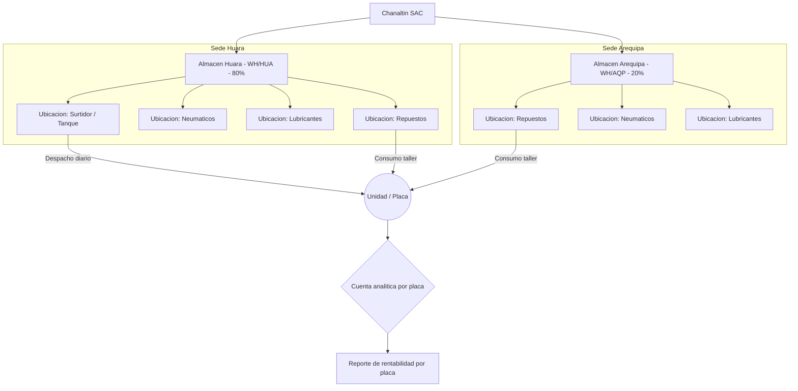
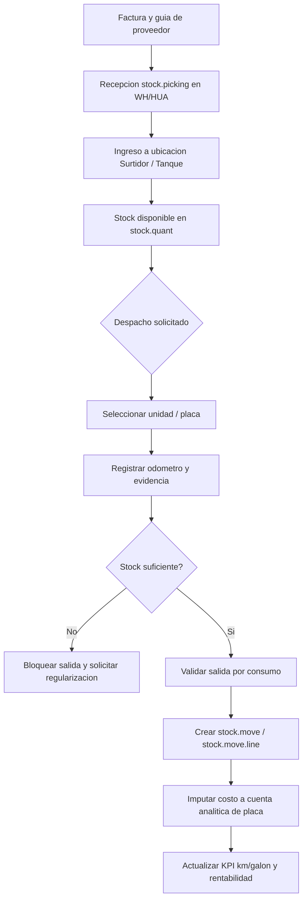
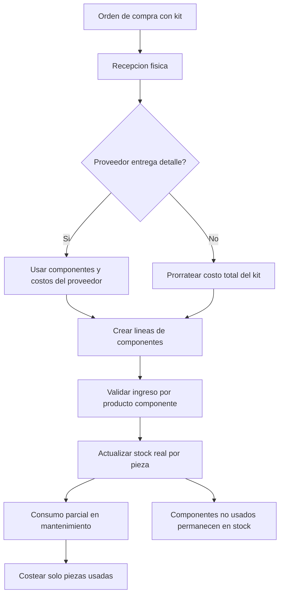
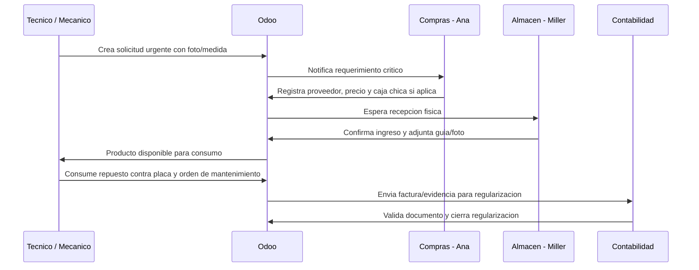
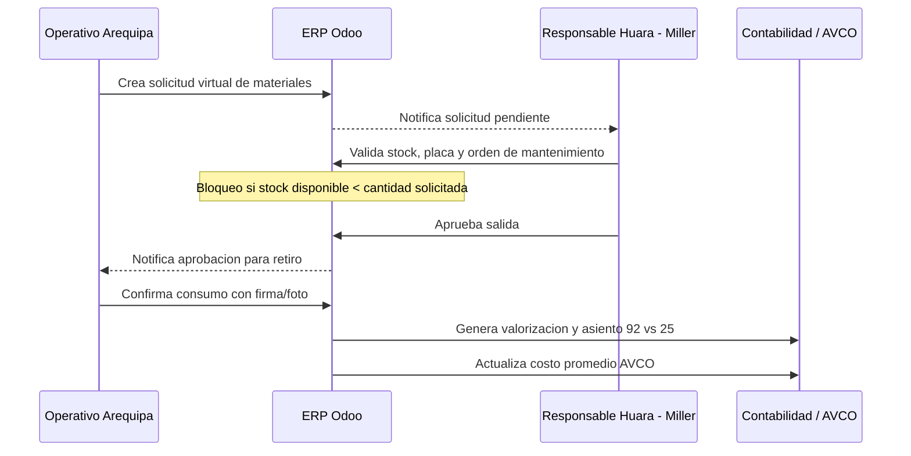
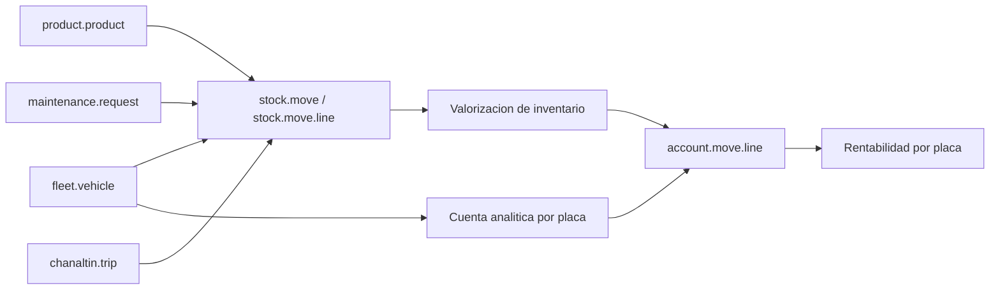

# 1.5. Inventario y Surtidor (Control de Insumos Criticos)

Objetivo: implementar trazabilidad total de combustible, urea, repuestos, llantas, lubricantes y compras urgentes por unidad, sede, orden de mantenimiento, viaje y cuenta analitica de placa.

La Fase 1.5 debe partir de Odoo v18 nativo, pero con parametrizacion estricta y extensiones puntuales para evitar los problemas actuales: consumo sin registro previo, diferencias entre stock fisico y sistema, saldos negativos, kits con saldos fantasmas y combustible sin costo exacto por placa.

## Evaluacion de Funcionalidad Nativa Odoo v18

Odoo ya provee una base solida para almacenes, ubicaciones, movimientos, compras y valorizacion. La personalizacion debe concentrarse en la disciplina operativa y en los campos que conectan cada consumo con la flota.

Modelos nativos recomendados:

- `stock.warehouse`: almacenes fisicos por sede, con codigos como `WH/HUA` y `WH/AQP`.
- `stock.location`: ubicaciones internas jerarquicas por repuestos, llantas, lubricantes y surtidor.
- `stock.picking`: documento operativo para recepciones, transferencias internas y salidas por consumo.
- `stock.move`: movimiento de producto planificado y valorizado.
- `stock.move.line`: detalle ejecutado del movimiento, cantidades reales, ubicacion, lote/serie y unidad de medida.
- `stock.quant`: existencia fisica por producto, ubicacion, lote y cantidad disponible.
- `stock.warehouse.orderpoint`: reglas de stock minimo para repuestos criticos.
- `product.template` / `product.product`: maestro de productos almacenables, repuestos, combustibles, urea, llantas y componentes de kits.
- `uom.uom`: unidades de medida. Diesel en galones y urea en litros, sin conversiones operativas.
- `purchase.order` / `purchase.order.line`: ordenes de compra normales, compras urgentes y trazabilidad de recepcion.
- `account.move` / `account.move.line`: factura de proveedor, valorizacion y asiento contable.
- `analytic_distribution`: distribucion analitica en lineas de compra y contabilidad para cargar costos a placa, ruta o centro de costo.
- `fleet.vehicle`: unidad receptora del consumo, placa, odometro y cuenta analitica.
- `maintenance.request`: orden de taller vinculada al consumo de repuestos o a la compra urgente.

## Configuracion de Sedes y Almacenes

Se deben configurar dos almacenes principales con tipos de operacion propios: recepciones, transferencias internas, salidas por consumo y ajustes autorizados.

| Almacen | Codigo | Rol operativo | Consideraciones |
| --- | --- | --- | --- |
| Huara | `WH/HUA` | Sede central y aproximadamente 80% del stock | Recepciona compras masivas, administra el surtidor principal de 10,000 galones y valida solicitudes de Arequipa. |
| Arequipa | `WH/AQP` | Sede secundaria y aproximadamente 20% del stock | Debe dejar de operar bajo consumo primero y reporte posterior. Requiere usuarios operativos y solicitud virtual previa. |

Ubicaciones internas minimas:

- Repuestos: filtros, piezas de motor, accesorios menores y componentes individuales de kits.
- Neumaticos: llantas nuevas, reencauchadas y bajas por descarte.
- Lubricantes: aceites, grasas, baldes y productos medidos por galon o unidad equivalente.
- Surtidor / Tanque: ubicacion exclusiva para diesel y urea. En Huara debe representar el tanque estacionario principal.

## Gestion del Surtidor

El surtidor es un control critico porque el combustible es uno de los costos de mayor impacto en la rentabilidad por placa.

### Unidades de Medida Estrictas

- Diesel: producto almacenable, comprado, almacenado y despachado exclusivamente en galones.
- Urea: producto almacenable, comprado, almacenado y despachado exclusivamente en litros.
- No debe permitirse que una orden de compra use una unidad y el despacho otra si eso introduce conversiones manuales o redondeos.
- En `product.template`, `uom_id` y `uom_po_id` deben coincidir para estos productos criticos.

### Ingresos Masivos al Tanque

- Huara cuenta con un tanque aproximado de 10,000 galones.
- La compra tipica es de aproximadamente 9,000 galones cada 15 a 20 dias.
- La operacion puede representar alrededor de S/ 150,000 por abastecimiento.
- La recepcion debe vincular factura de proveedor, guia de remision y evidencia de recepcion fisica.
- Miller, como responsable de almacen, registra la recepcion en Odoo al momento de la descarga fisica para evitar saldos negativos posteriores.

### Despacho a Unidad

Cada despacho debe ser rapido, pero obligatorio en datos:

- Placa / `fleet.vehicle` receptora.
- Conductor o responsable del abastecimiento, cuando aplique.
- Producto: diesel o urea.
- Cantidad despachada.
- Odometro actual de la unidad.
- Foto del odometro o evidencia equivalente mientras no exista integracion automatica.
- Viaje asociado (`chanaltin.trip`) si el despacho corresponde a una ruta programada.
- Cuenta analitica de la placa para afectar rentabilidad.

La integracion futura con PRODCOM / FROTCOM debe sincronizar lecturas del surtidor, kilometraje y telemetria para detectar desviaciones de combustible.

## Desglose de Kits de Repuestos

Los kits no deben manejarse como un unico producto cuando el consumo real en taller ocurre por piezas. La regla de oro es: si el mecanico consume piezas individuales, el inventario debe registrar piezas individuales.

### Reglas de Registro

- Cada componente del kit debe existir como `product.product` independiente.
- La orden de compra puede incluir el kit si el proveedor factura asi, pero la recepcion fisica debe desglosarlo en componentes.
- Si el proveedor entrega el detalle de componentes y costos, Odoo debe usar esos valores.
- Si no existe detalle del proveedor, el sistema debe permitir prorratear el costo total del kit entre componentes.
- La salida de almacen debe consumir solo las piezas realmente usadas.
- Las piezas retiradas y no usadas deben volver formalmente a stock.
- El costo de mantenimiento debe reflejar solo los componentes consumidos en la orden de trabajo.

### Desarrollo Propuesto

Crear un asistente o modelo de desglose para recepciones de kits:

| Modelo / extension | Campo | Proposito |
| --- | --- | --- |
| `chanaltin.kit.breakdown` | `purchase_order_id` | Orden de compra que origina el kit. |
| `chanaltin.kit.breakdown` | `picking_id` | Recepcion donde se ingresaran los componentes. |
| `chanaltin.kit.breakdown` | `kit_product_id` | Producto kit comprado o facturado. |
| `chanaltin.kit.breakdown` | `total_cost` | Costo total a distribuir. |
| `chanaltin.kit.breakdown.line` | `component_product_id` | Producto componente que entrara a stock. |
| `chanaltin.kit.breakdown.line` | `component_qty` | Cantidad del componente recibido. |
| `chanaltin.kit.breakdown.line` | `component_cost` | Costo unitario recibido o prorrateado. |
| `chanaltin.kit.breakdown.line` | `cost_source` | Proveedor, prorrateo interno o ajuste autorizado. |

## Compras Urgentes y Via Rapida

Las compras urgentes ocurren cuando una unidad, camion o montacargas queda parada por falla critica. El flujo actual inicia por WhatsApp porque el tecnico suele identificar la pieza por foto, medida o muestra fisica, no por codigo de producto.

### Flujo Operativo

- Activador: unidad inoperativa por falla critica detectada al retorno, en taller o en ruta.
- Solicitante: mecanico o tecnico.
- Compras: Ana Rojas cotiza rapidamente con proveedores especializados.
- Pago: puede usarse caja chica de logistica cuando la urgencia no permite esperar el ciclo normal de pagos.
- Recepcion: Miller recibe fisicamente, sella recepcion y adjunta soporte.
- Regularizacion: contabilidad valida factura y sustento para reembolso o registro formal.

### Requerimiento en Odoo

Se recomienda crear `chanaltin.urgent.purchase.request` o extender `purchase.order` con campos de via rapida.

| Campo | Tipo sugerido | Proposito |
| --- | --- | --- |
| `is_urgent_purchase` | Boolean | Identifica compra de emergencia. |
| `maintenance_request_id` | Many2one `maintenance.request` | Vincula la compra a la orden de taller. |
| `vehicle_id` | Many2one `fleet.vehicle` | Placa afectada y cuenta analitica destino. |
| `requested_by_id` | Many2one `res.users` / `hr.employee` | Tecnico o mecanico solicitante. |
| `buyer_id` | Many2one `res.users` | Responsable de compras. |
| `petty_cash_used` | Boolean | Indica uso de caja chica. |
| `regularization_state` | Selection | Pendiente, documentos recibidos, validado, observado, cerrado. |
| `evidence_attachment_ids` | Many2many `ir.attachment` | Fotos, capturas de WhatsApp, medidas y documentos. |
| `regularization_deadline` | Date | Fecha maxima para completar sustento. |

La via rapida no debe permitir consumos invisibles. Debe permitir comprar y recibir con urgencia, pero siempre dejar trazabilidad de placa, orden de mantenimiento, evidencia y responsable.

## Flujo Virtual de Solicitud y Aprobacion en Arequipa

Arequipa debe abandonar el modelo de consumo primero y reporte despues. El flujo objetivo es solicitud, aprobacion, retiro fisico, confirmacion y asiento.

Modelo propuesto: `chanaltin.material.request`.

Campos clave:

- `name`: folio de solicitud.
- `warehouse_id`: almacen solicitante, normalmente `WH/AQP`.
- `location_id`: ubicacion interna de origen.
- `requested_by_id`: usuario operativo que solicita.
- `approved_by_id`: responsable de aprobacion en Huara.
- `vehicle_id`: placa o unidad receptora.
- `maintenance_request_id`: orden de mantenimiento, si aplica.
- `trip_id`: viaje asociado, si aplica.
- `state`: borrador, solicitado, aprobado, rechazado, consumido, cancelado.
- `line_ids`: productos, cantidades, unidad de medida y observaciones.
- `evidence_attachment_ids`: foto, firma digital o sustento de retiro.
- `stock_picking_id`: salida por consumo generada tras aprobacion.

Si se integran chapas inteligentes o contenedores controlados, la aprobacion en Odoo debe ser el evento previo que autorice la apertura fisica.

## Control Financiero de Inventarios

El objetivo financiero es eliminar diferencias entre inventario fisico y sistema. En marzo de 2026 se identificaron diferencias de referencia por S/ 966 en Huara y S/ 1,553 en Arequipa; la causa raiz es la desconexion entre recepcion fisica, consumo real y regularizacion documentaria.

### Metodo AVCO

- Configurar categorias de producto con costo promedio ponderado cuando aplique.
- AVCO es adecuado para repuestos, lubricantes y combustible donde el costo se promedia por ingresos sucesivos.
- La salida valorizada debe afectar la cuenta de existencias y el costo de servicio.
- Referencia contable esperada: Cuenta 25 Existencias contra Cuenta 92 Costo de Servicio, segun plan contable y configuracion local.
- Las lineas contables deben heredar la cuenta analitica de la placa o la distribucion analitica definida.

### Bloqueo de Stock Negativo

La salida por consumo no debe validarse si el stock real disponible en `stock.quant` es insuficiente.

Esta regla corrige casos donde el repuesto se consume el dia 22, pero la factura se registra el dia 27. Para no detener operaciones ante emergencias, la via rapida debe crear el ingreso inmediato en Odoo antes del despacho, aunque la factura final se regularice despues.

## Vinculacion con Placa, Taller y Rentabilidad

Todo consumo debe conectar inventario con flota:

- `fleet.vehicle` define la placa receptora.
- La placa debe tener una cuenta analitica o distribucion analitica por defecto.
- `maintenance.request` permite asociar repuestos al trabajo de taller.
- `chanaltin.trip` permite asociar combustible, urea o insumos al viaje.
- `account.move.line` debe recibir la distribucion analitica para alimentar rentabilidad por placa.

## Campos Tecnicos Propuestos

### Extension de `stock.picking`

| Campo | Tipo sugerido | Uso |
| --- | --- | --- |
| `chanaltin_flow_type` | Selection | Recepcion normal, consumo taller, despacho surtidor, compra urgente, solicitud Arequipa, retorno a stock. |
| `vehicle_id` | Many2one `fleet.vehicle` | Placa receptora cuando el picking representa consumo. |
| `maintenance_request_id` | Many2one `maintenance.request` | Orden de taller vinculada. |
| `trip_id` | Many2one `chanaltin.trip` | Viaje asociado al despacho de combustible o insumos. |
| `material_request_id` | Many2one `chanaltin.material.request` | Solicitud virtual que origina la salida. |
| `urgent_purchase_request_id` | Many2one `chanaltin.urgent.purchase.request` | Via rapida que origina la recepcion. |
| `evidence_attachment_ids` | Many2many `ir.attachment` | Fotos, guias, capturas y sustento. |

### Extension de `stock.move` / `stock.move.line`

| Campo | Tipo sugerido | Uso |
| --- | --- | --- |
| `vehicle_id` | Many2one `fleet.vehicle` | Placa receptora de la linea de consumo. |
| `analytic_distribution` | Json / campo compatible con `analytic.mixin` | Distribucion del costo hacia placa o centro de costo. |
| `odometer_value` | Float | Kilometraje capturado al despacho de combustible. |
| `engine_hours_value` | Float | Horometro para montacargas o equipos por horas. |
| `is_fuel_dispatch` | Boolean | Identifica despacho desde surtidor. |
| `fuel_dispatch_id` | Many2one `chanaltin.fuel.dispatch` | Registro especializado del abastecimiento. |

### Extension de `product.template`

| Campo | Tipo sugerido | Uso |
| --- | --- | --- |
| `chanaltin_material_type` | Selection | Diesel, urea, repuesto, llanta, lubricante, kit, componente de kit, servicio. |
| `strict_uom_control` | Boolean | Impide diferencias entre `uom_id` y `uom_po_id` para productos criticos. |
| `is_critical_stock` | Boolean | Activa seguimiento preventivo. |
| `critical_min_qty` | Float | Minimo operacional para alertas. |
| `requires_vehicle_on_consumption` | Boolean | Obliga placa en salidas. |
| `requires_odometer_on_consumption` | Boolean | Obliga odometro para combustible. |

### Modelo `chanaltin.fuel.dispatch`

| Campo | Tipo sugerido | Uso |
| --- | --- | --- |
| `name` | Char | Folio de despacho. |
| `warehouse_id` | Many2one `stock.warehouse` | Almacen del surtidor. |
| `location_id` | Many2one `stock.location` | Ubicacion tanque. |
| `vehicle_id` | Many2one `fleet.vehicle` | Placa abastecida. |
| `driver_id` | Many2one `hr.employee` | Conductor o responsable. |
| `trip_id` | Many2one `chanaltin.trip` | Viaje relacionado. |
| `product_id` | Many2one `product.product` | Diesel o urea. |
| `quantity` | Float | Cantidad despachada. |
| `uom_id` | Many2one `uom.uom` | Galones o litros estrictos. |
| `odometer_value` | Float | Kilometraje de abastecimiento. |
| `stock_move_id` | Many2one `stock.move` | Movimiento valorizado. |
| `photo_odometer` | Binary / `ir.attachment` | Evidencia temporal hasta integracion GPS. |
| `source` | Selection | Manual, PRODCOM, FROTCOM, importacion. |

## Reglas de Negocio

| Regla | Descripcion | Accion del sistema |
| --- | --- | --- |
| BR-INV-001 | Todo consumo de repuesto, combustible, urea, llanta o lubricante debe tener placa o centro de costo. | Bloquear validacion del movimiento si falta `vehicle_id` o distribucion analitica. |
| BR-INV-002 | Diesel usa galones y urea usa litros durante compra, inventario y despacho. | Bloquear cambios de unidad en productos con `strict_uom_control`. |
| BR-INV-003 | No se permiten salidas con stock negativo. | Validar existencia en `stock.quant` antes de confirmar consumo. |
| BR-INV-004 | Arequipa no puede consumir sin solicitud previa aprobada. | Exigir `chanaltin.material.request` en salidas de `WH/AQP`. |
| BR-INV-005 | El despacho de combustible requiere placa, cantidad y odometro. | Bloquear `chanaltin.fuel.dispatch` si faltan datos obligatorios. |
| BR-INV-006 | Toda recepcion masiva de combustible requiere factura, guia o evidencia de recepcion. | Crear actividad pendiente si faltan adjuntos. |
| BR-INV-007 | Los kits con consumo parcial deben entrar como componentes. | Bloquear recepcion final de kits sin desglose aprobado. |
| BR-INV-008 | La compra urgente debe regularizarse sin perder trazabilidad. | Permitir via rapida, pero exigir placa, evidencia, responsable y estado de regularizacion. |
| BR-INV-009 | Repuestos criticos deben tener stock minimo. | Usar `stock.warehouse.orderpoint` y alertas de reposicion. |
| BR-INV-010 | El costo debe alimentar rentabilidad por placa. | Propagar cuenta analitica hacia `account.move.line` y reportes. |

## Consideraciones de Implementacion

- Priorizar configuracion nativa antes de crear modelos paralelos: almacenes, ubicaciones, productos, unidades de medida, categorias, rutas de operacion, reglas de reabastecimiento y valorizacion.
- Crear modelos nuevos solo para flujos que Odoo no cubre de forma directa: solicitud virtual Arequipa, despacho especializado de surtidor, desglose de kits y via rapida de compras urgentes.
- Mantener los adjuntos en Odoo (`ir.attachment`) aunque exista SharePoint, para que el flujo operativo no dependa de buscar evidencia en otra plataforma.
- Evitar que contabilidad regularice dias despues sin recepcion previa; primero debe existir el movimiento fisico en Odoo y luego la factura puede completar el sustento.
- Toda automatizacion de GPS o surtidor debe escribir sobre registros operativos auditables, no reemplazar manualmente movimientos valorizados.
