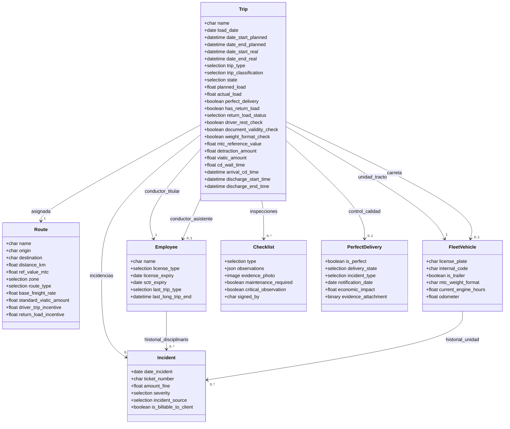
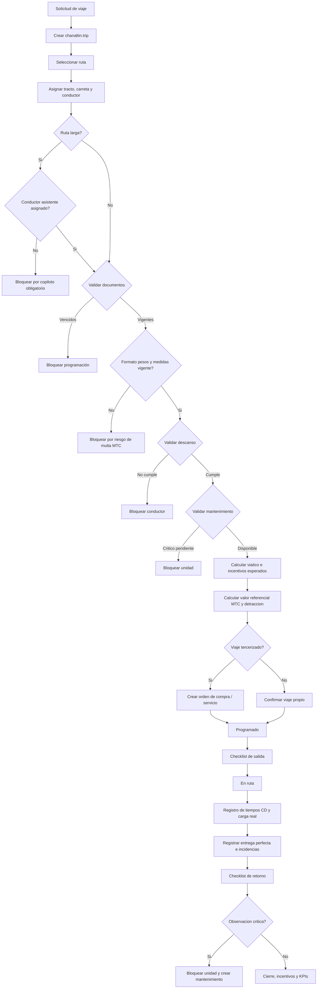
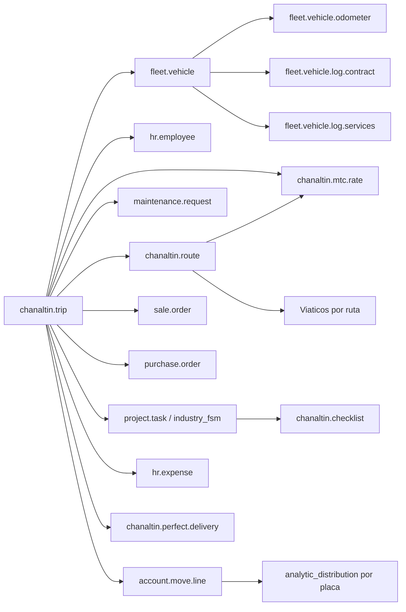

# 1. Sistema Avanzado de Programación de Viajes (Trip Scheduling)

El Sistema Avanzado de Programación de Viajes para Chanaltín centraliza la planificación, validación de seguridad y control de costos. Su objetivo es reemplazar el uso de Excel y procesos manuales por un flujo integrado en Odoo v18.

## Gestión de Flota y Operaciones Avanzadas

El estándar de Odoo v18 proporciona los cimientos de flota, empleados, mantenimiento, ventas, compras, contabilidad y servicios de campo. Sin embargo, la operación de Chanaltín requiere una arquitectura extendida porque el proceso real combina programación de viajes, doble conductor, tracto, carreta, retornos con carga, control documental, checklists, incidencias y rentabilidad por placa.

### Módulos de Odoo Involucrados

- **Flota (`fleet`):** Gestión de activos como tractos, carretas y montacargas. Aporta `fleet.vehicle`, placa, odómetro, contratos, servicios y logs de asignación.
- **Empleados (`hr`):** Legajos de conductores, datos privados de empleado, puesto, calendario laboral y estructura organizativa mediante `hr.employee`.
- **Mantenimiento (`maintenance`):** Órdenes de trabajo, mantenimiento preventivo/correctivo, equipos, estados, prioridades y bloqueos operativos mediante `maintenance.request`.
- **Servicios de Campo (`industry_fsm`):** Ejecución móvil de tareas, firmas, reportes y checklists sobre `project.task`.
- **Ventas (`sale`):** Facturación de fletes, servicios de alquiler y vínculo comercial con el cliente.
- **Compras (`purchase`):** Órdenes de servicio o compra para transportistas terceros.
- **Contabilidad (`account_accountant`):** Asientos, líneas contables, conciliación y distribución analítica para medir rentabilidad por placa, ruta o centro de costo.

### Enfoque de Arquitectura

La recomendación es extender modelos estándar cuando ya existe un objeto de negocio sólido, y crear modelos nuevos solo donde Odoo no cubre el dominio logístico de Chanaltín.

- Extender `fleet.vehicle` para datos técnicos de tractos, carretas, montacargas, documentos y horómetros.
- Extender `hr.employee` para datos de conductor, licencias, SCTR, descanso y estado operativo.
- Crear `chanaltin.trip` como objeto central de viaje.
- Crear `chanaltin.route` para parametrizar origen, destino, distancia, zona y valor referencial MTC.
- Crear `chanaltin.checklist` o integrar con `project.task`/FSM cuando el checklist deba ejecutarse en móvil.
- Crear `chanaltin.incident` para papeletas, SUTRAN, SAT, incidencias disciplinarias y responsabilidad económica.

## Gestión de Insumos para la Programación

El proceso inicia cuando se recibe la necesidad de servicio y requiere consolidar los siguientes datos maestros:

- **Asignación multivariable:** Unidad (tracto), carreta, conductor titular y, en rutas largas, conductor asistente.
- **Definición de rutas:** Clasificación entre rutas cortas y rutas largas para aplicar reglas de descanso y viáticos.
- **Tercerización:** Posibilidad de asignar viajes a proveedores terceros, generando una Orden de Servicio vinculada para controlar el costo.

## Motor de Validaciones Críticas

Validaciones automáticas antes de confirmar una programación:

- **Control de descansos:** Si un conductor realiza una ruta larga, no debe programarse inmediatamente otra ruta larga.
- **Disponibilidad documental:** Bloqueo si la unidad o el conductor tienen documentos vencidos: SOAT, revisión técnica, brevete, SCTR, entre otros.
- **Estado de mantenimiento:** Sincronización con el módulo de taller para impedir despachos si hay mantenimiento crítico pendiente.

## Ejecución y Seguimiento de Viaje

Durante y después del viaje se registran y gestionan:

- **Documentación de salida:** Generación o vinculación de Guía de Remisión Transportista electrónica.
- **Carga operativa:** Registro de capacidad vs. carga real.
- **Integración de viáticos:** Conexión con el módulo de Gastos para liquidar montos por placa y ruta.

## Cierre Operativo y Data Sucia

Al retorno, el planificador cierra el viaje y alimenta el repositorio operacional para KPIs:

- **KPI Entrega Perfecta:** Incidencias, faltantes, daños y demoras.
- **Tiempos de atención:** Horas de llegada, inicio de descarga y salida en centros de distribución.
- **Gestión de retornos:** Indicador de retorno con o sin carga que impacta la rentabilidad por placa.

## Integración con Planilla y Contabilidad

Automatizaciones administrativas relacionadas con la programación:

- **Cálculo de incentivos:** Pagos variables a conductores basados en viajes y retornos.
- **Valor referencial MTC:** Cálculo automatizado para detracciones del 4%.

## Propuesta de Nuevos Modelos y Campos

Odoo nativo no tiene un objeto de viaje que gestione simultáneamente dos conductores, una unidad tracto, una carreta, retorno con carga, data operativa y validaciones de seguridad. Por ello, el modelo `chanaltin.trip` debe ser el corazón operativo del flujo.

### Diagrama de Clases

### Flujo de Validación de Viaje

### Integración Funcional con Odoo

## Detalle de Campos Críticos

### A. `chanaltin.trip` (Viaje) - Nuevo

Este modelo concentra la programación, seguimiento y cierre del viaje.

Campos principales:

- `name`: folio de viaje.
- `date_start_planned` / `date_end_planned`: fechas planificadas.
- `date_start_real` / `date_end_real`: fechas reales.
- `load_date`: fecha de carga de la mercancía.
- `trip_type` / `trip_classification`: corta o larga; dispara reglas de descanso, copiloto y viáticos.
- `state`: borrador, programado, en ruta, retorno, cerrado o cancelado.
- `route_id`: ruta asignada.
- `vehicle_id`: unidad tracto.
- `trailer_id`: carreta.
- `driver_id`: conductor titular.
- `assistant_driver_id`: conductor asistente, obligatorio en rutas largas.
- `planned_load`: capacidad planificada.
- `actual_load`: carga real.
- `perfect_delivery`: indicador de entrega perfecta.
- `has_return_load`: retorno con carga.
- `return_load_status`: vacío, carga propia o carga de terceros.
- `mtc_reference_value`: valor referencial MTC calculado.
- `detraction_base_amount`: mayor valor entre flete pactado y valor referencial MTC.
- `detraction_amount`: detracción del 4%.
- `viatic_amount`: viático sugerido tomado de la ruta.
- `trip_incentive_amount`: incentivo por viaje cerrado.
- `return_incentive_amount`: incentivo por retorno con carga.

Campos de validación:

- `driver_rest_check`: valida si el conductor cumplió descanso tras una ruta larga.
- `document_validity_check`: bloquea salida si SOAT, revisión técnica, brevete o SCTR están vencidos.
- `weight_format_check`: valida vigencia del Formato de Pesos y Medidas, crítico por riesgo de multas elevadas.
- `maintenance_block_check`: bloquea si la unidad tiene mantenimiento crítico abierto.
- `third_party_check`: valida proveedor, unidad y conductor externo cuando el viaje es tercerizado.

Campos de data operativa:

- `departure_time`: hora exacta de salida.
- `arrival_time`: hora de llegada al destino.
- `arrival_cd_time`: llegada al centro de distribución.
- `discharge_start_time`: inicio de descarga.
- `discharge_end_time`: fin de descarga.
- `cd_wait_time`: tiempo muerto en CD calculado como inicio de descarga menos llegada al CD.
- `return_start_time`: inicio del retorno.
- `return_end_time`: fin del retorno.
- `dead_time_hours`: tiempo muerto calculado.
- `fuel_gallons`: galones abastecidos para el viaje.
- `fuel_efficiency`: rendimiento km/galón.
- `distance_traveled_km`: kilómetros recorridos reales.
- `operational_observations`: observaciones operativas del viaje.

### B. `chanaltin.route` (Ruta) - Nuevo

Campos principales:

- `name`: origen - destino.
- `origin_id` / `destination_id`: puntos operativos.
- `distance_km`: distancia estimada.
- `ref_value_mtc`: valor referencial MTC.
- `zone`: norte, sur, centro u otra clasificación operativa.
- `route_type`: corta o larga.
- `estimated_travel_hours`: tiempo estimado de viaje.
- `mtc_segment_ids`: tramos oficiales MTC aplicables.
- `province_ids`: provincias involucradas en la ruta.
- `mtc_cost_per_ton`: costo por tonelada según tabla vigente.
- `base_freight_rate`: tarifa base pactada para la ruta.
- `customer_id`: cliente asociado si existen tarifas diferenciadas.
- `default_viatic_amount`: viático sugerido.
- `viatic_dinner_amount`: viático ampliado cuando el retorno posterior incluye cena.
- `expected_transit_hours`: horas esperadas de tránsito.
- `driver_trip_incentive`: incentivo por viaje cerrado, por ejemplo S/ 36.66.
- `return_load_incentive`: incentivo por retorno con carga, por ejemplo S/ 50.00.
- `analytic_account_id`: cuenta analítica sugerida para rentabilidad.

### C. Extensiones a `fleet.vehicle`

Odoo ya aporta placa, odómetro, conductor actual, contratos y servicios. Chanaltín debe extenderlo con campos operativos para transporte pesado:

- `internal_code`: código interno de Chanaltín.
- `is_trailer`: diferencia tractos de carretas.
- `vehicle_operation_type`: tracto, carreta, montacargas u otro activo operativo.
- `mtc_weight_format`: formato de pesos y medidas.
- `mtc_weight_format_expiry`: vencimiento del Formato de Pesos y Medidas.
- `current_engine_hours`: horómetro actualizado por GPS, clave para montacargas.
- `soat_expiry`: vencimiento SOAT.
- `technical_review_expiry`: vencimiento de revisión técnica.
- `capacity_ton`: capacidad máxima permitida.
- `operational_status`: disponible, programado, en ruta, mantenimiento, bloqueado.
- `analytic_account_id`: cuenta analítica por placa o centro de costo.

Consideración: para kilometraje debe reutilizarse `fleet.vehicle.odometer`. Para costos de servicios existentes debe evaluarse `fleet.vehicle.log.services` antes de crear modelos paralelos.

### D. Extensiones a `hr.employee`

El conductor debe ser empleado cuando pertenece a Chanaltín. Para terceros, se puede evaluar `res.partner` o una extensión de homologación vinculada al proveedor.

Campos propuestos:

- `is_driver`: identifica empleados conductores.
- `license_type`: categoría de brevete.
- `license_expiry`: vencimiento de licencia.
- `sctr_expiry`: vencimiento de seguro complementario.
- `last_trip_type`: último viaje corto o largo.
- `last_long_trip_end`: fecha/hora de cierre del último viaje largo.
- `driving_hours_accumulated`: horas efectivas de conducción acumuladas.
- `rest_until`: fecha/hora mínima hasta la que debe descansar.
- `rest_exception_authorized`: excepción documentada y autorizada por operación.
- `driver_status`: disponible, descansando, bloqueado, de vacaciones, suspendido.
- `incident_count`: contador de incidencias abiertas o relevantes.

### E. `chanaltin.checklist` (Checklist) - Nuevo o Integrado con FSM

Para checklist simple se puede crear modelo propio. Si requiere ejecución móvil, firma, evidencia y reporte al cliente, conviene integrarlo con `project.task` de `industry_fsm`.

Campos:

- `trip_id`: viaje asociado.
- `vehicle_id`: unidad inspeccionada.
- `driver_id`: responsable de la inspección.
- `type`: salida, retorno, entrega, recepción o auxilio.
- `observations`: JSON con luces, llantas, frenos, documentos, carrocería, EPP y otros controles.
- `evidence_photo`: evidencia fotográfica.
- `maintenance_required`: dispara solicitud a mantenimiento.
- `critical_observation`: observación crítica que bloquea la unidad para la siguiente programación.
- `maintenance_request_id`: vínculo a `maintenance.request`.
- `fsm_task_id`: vínculo a `project.task` si se usa Field Service.

### F. `chanaltin.incident` (Incidencias/Papeletas) - Nuevo

Modelo para digitalizar papeletas, incidencias operativas, sanciones y responsabilidades económicas.

Campos:

- `vehicle_id`: placa involucrada.
- `driver_id`: conductor responsable.
- `trip_id`: viaje relacionado.
- `date_incident`: fecha de incidencia.
- `ticket_number`: papeleta o número de expediente.
- `amount_fine`: importe de multa.
- `severity`: baja, media, alta o crítica.
- `incident_source`: SUTRAN, SAT, municipal, cliente, taller u operación interna.
- `is_billable_to_client`: indica si debe reembolsarse por cliente.
- `state`: borrador, en revisión, apelado, confirmado, cerrado.

### G. `chanaltin.perfect.delivery` (Entrega Perfecta) - Nuevo

Modelo para digitalizar el reporte de Entrega Perfecta y alimentar el KPI de calidad de servicio.

Campos:

- `trip_id`: viaje relacionado.
- `vehicle_id`: placa asociada.
- `driver_id`: conductor responsable.
- `delivery_state`: estado general de entrega.
- `is_perfect`: indicador Sí/No.
- `incident_type`: faltante, carga dañada, carga torcida, problema de descarga, estibadores adicionales, cobro adicional, observación del almacenero o demora en recepción.
- `notification_date`: fecha de notificación de la incidencia.
- `reported_by`: responsable que reporta.
- `economic_impact`: costo estimado de la falla.
- `warehouse_observation`: observación del almacenero receptor.
- `evidence_attachment_ids`: fotos, documentos o adjuntos de sustento.

### H. `chanaltin.mtc.rate` y Tablas MTC - Nuevo

Modelo maestro para automatizar el valor referencial MTC y la detracción.

Campos:

- `route_id`: ruta aplicable.
- `segment_id`: tramo oficial MTC.
- `province_ids`: provincias consideradas.
- `valid_from` / `valid_to`: vigencia de tabla.
- `cost_per_ton`: costo por tonelada.
- `load_factor`: factor de carga.
- `min_reference_value`: valor mínimo legal.

La regla de cálculo debe tomar origen, destino, tramos MTC, peso real o capacidad configurada, y comparar el valor referencial calculado contra el flete pactado. La base de detracción será el mayor de ambos importes y se aplicará la tasa del 4% para transporte de bienes.

## Data Sucia Integrada al Viaje

El archivo llamado internamente "Data Sucia" es la fuente real de inteligencia operativa. En Odoo debe dejar de ser un Excel aislado y convertirse en campos estructurados dentro del viaje, la entrega perfecta, el retorno, combustible y disponibilidad de flota.

### Identificación y Trazabilidad

- Fecha de carga.
- Fecha y hora de salida.
- Placa de unidad.
- Placa de carreta.
- Conductor titular.
- Conductor asistente.
- Ruta origen-destino.

### Operación y Tiempos

- Capacidad del vehículo.
- Carga real transportada.
- Hora de llegada al destino o CD.
- Hora de inicio de descarga.
- Hora de fin de descarga.
- Hora de retorno a base.
- Retorno vacío, con carga propia o con carga de terceros.
- Tiempo muerto en CD.

### Rendimiento y Calidad

- Galones abastecidos.
- Rendimiento de combustible en km/galón.
- Kilómetros recorridos.
- Entrega perfecta Sí/No.
- Incidencias de faltante, daño, carga torcida, demoras o problemas de descarga.
- Observaciones operativas.

### Disponibilidad de Flota

- Operatividad de la unidad.
- Días trabajados.
- Motivos de no operación: taller, falta de conductor, falta de carga, documentos vencidos u otro bloqueo.

La digitalización de estos campos permite calcular rentabilidad por placa, dashboards de KPIs y control operativo en tiempo real sin transcripción manual desde WhatsApp, papeles o Excel.

## Automatizaciones Financieras y Tributarias

### Valor Referencial MTC y Detracción

El cálculo debe ejecutarse al programar el viaje y antes de facturar:

- Tomar ruta, tramos, provincias, peso real/capacidad y tarifa pactada.
- Calcular el valor referencial con tablas MTC vigentes.
- Comparar flete pactado vs. valor referencial.
- Tomar el mayor importe como base de detracción.
- Aplicar detracción del 4%.
- Registrar el valor referencial en factura electrónica o Guía de Remisión Transportista cuando corresponda.
- Generar reportes de soporte para controles tributarios como Formulario 4702 o equivalentes.

### Viáticos por Ruta

Los viáticos deben parametrizarse en el Maestro de Rutas:

- S/ 40.00 para rutas estándar que cubren desayuno y almuerzo.
- S/ 55.00 para rutas largas o retornos posteriores que incluyen cena.
- Monto sugerido jalado automáticamente al seleccionar ruta en `chanaltin.trip`.
- Generación de anticipo o solicitud de fondos a Tesorería.
- Trazabilidad Ruta -> Viaje -> Anticipo -> Gasto.
- Rendición digital mediante Gastos para peajes, alimentación, lavados y otros comprobantes.
- Posibilidad de regularizar cambios de último minuto por conductor enfermo, cambio de unidad o cambio de ruta.

### Motor de Incentivos

La programación de viajes debe ser input para planilla:

- Contar viajes cerrados por conductor.
- Contar retornos con carga.
- Aplicar incentivo por viaje, por ejemplo S/ 36.66.
- Aplicar incentivo por retorno con carga, por ejemplo S/ 50.00.
- Registrar excepciones y ajustes aprobados por operación o planilla.

### Rentabilidad por Placa

El reporte por placa debe consolidar ingresos y costos directos/indirectos:

- Ingresos por flete e incremento de combustible.
- Combustible propio y externo valorizado con costo promedio.
- Viáticos liquidados.
- Peajes.
- Mantenimiento preventivo/correctivo.
- Repuestos y mano de obra de taller.
- Planilla e incentivos prorrateados.
- Seguros, depreciación y leasing.
- Margen operativo por km.
- Días trabajados vs. días parados.

La contabilidad analítica debe ser obligatoria en cuentas de gasto relevantes para evitar costos sin placa o centro de costo.

## Consideraciones de Lógica

## Reglas de Negocio Obligatorias

Estas reglas deben implementarse como validaciones sistémicas duras. El objetivo es impedir que el planificador confirme viajes que expongan a Chanaltín a fatiga de conductores, multas, unidades no aptas, pérdidas de margen o data operativa incompleta.

### BR-001. Asignación dual obligatoria en rutas largas

- Si `trip_classification = larga`, el campo `assistant_driver_id` debe ser obligatorio.
- El conductor titular y el conductor asistente deben ser personas distintas.
- Ambos conductores deben pasar las mismas validaciones de disponibilidad, descanso, documentos e incidencias.
- Si falta copiloto o uno de los dos conductores no está disponible, el viaje no puede pasar a `programado`.

### BR-002. Control de fatiga y regla de oro

- Si un conductor cerró una ruta larga, el sistema debe bloquear su asignación inmediata a otra ruta larga.
- Durante el bloqueo, el conductor puede quedar en estado `en descanso` o ser sugerido solo para rutas cortas, según política operativa.
- La regla aplica tanto al conductor titular como al asistente.
- El sistema debe registrar horas efectivas de conducción y compararlas contra la política interna o normativa aplicable.
- Cualquier excepción debe exigir motivo, usuario autorizador, fecha/hora y trazabilidad en el chatter del viaje.

### BR-003. Bloqueo documental crítico

- La validación documental no debe ser solo una alerta visual.
- El viaje debe bloquearse si están vencidos o ausentes documentos obligatorios del conductor: brevete, SCTR u otros definidos por operación.
- El viaje debe bloquearse si están vencidos o ausentes documentos obligatorios de la unidad: SOAT, revisión técnica y Formato de Pesos y Medidas.
- El Formato de Pesos y Medidas debe tratarse como documento crítico porque su ausencia genera multas relevantes para la empresa.
- El bloqueo debe indicar exactamente qué documento impide el despacho.

### BR-004. Interconexión con taller y mantenimiento

- El viaje no debe confirmarse si la unidad tiene una solicitud de mantenimiento crítica abierta.
- El viaje no debe confirmarse si existe mantenimiento preventivo vencido por kilometraje u horómetro.
- Para montacargas, la regla base debe considerar mantenimientos por horas, por ejemplo cada 250 horas.
- Para tractos y carretas, la regla debe apoyarse en odómetro, estado operativo y solicitudes abiertas.
- Una observación crítica del checklist de retorno debe bloquear automáticamente la unidad para la siguiente programación y crear o vincular una solicitud de mantenimiento.

### BR-005. Captura obligatoria de Data Sucia para cierre

- Para cerrar un viaje, el sistema debe exigir los campos mínimos de operación real.
- Deben registrarse llegada al CD, inicio de descarga, fin de descarga y salida del CD para medir tiempos muertos atribuibles al cliente.
- Debe registrarse carga real transportada, kilómetros recorridos, galones abastecidos y rendimiento de combustible.
- Debe registrarse estado de retorno: vacío, carga propia o carga de terceros.
- Si falta data crítica, el viaje puede quedar en estado `pendiente de cierre`, pero no debe alimentar KPIs definitivos ni liquidaciones.

### BR-006. Entrega Perfecta e incidencias

- Todo viaje cerrado debe tener indicador `perfect_delivery`.
- Si `perfect_delivery = false`, debe existir al menos un motivo de incidencia.
- Motivos mínimos: faltante de productos, carga dañada, carga torcida, problemas de descarga, demora en recepción, estibadores adicionales, cobros adicionales u observación del almacenero.
- Cada incidencia debe poder registrar responsable, fecha de notificación, impacto económico, observación y evidencia documental.
- Esta información alimenta la Data Sucia y los dashboards de calidad de servicio.

### BR-007. Valor Referencial MTC y detracción

- Al seleccionar ruta y peso transportado, el sistema debe calcular el valor referencial MTC con tramos, provincias y tablas vigentes.
- El sistema debe comparar el flete pactado contra el valor referencial calculado.
- La base de detracción debe ser el mayor importe entre ambos.
- La detracción debe calcularse al 4%.
- El valor referencial debe quedar disponible para factura electrónica, guía o reportes tributarios.
- Si no existe tabla MTC vigente para la ruta, el sistema debe bloquear la facturación o marcar el viaje como pendiente de revisión tributaria.

### BR-008. Viáticos por ruta

- La ruta debe sugerir automáticamente el viático estándar al crear el viaje.
- Monto base sugerido: S/ 40.00 para rutas cortas o estándar.
- Monto ampliado sugerido: S/ 55.00 para rutas largas o retornos posteriores que incluyen cena.
- El viaje debe conservar trazabilidad Ruta -> Viaje -> Anticipo -> Gasto.
- Si hay cambio de conductor, unidad o ruta, el sistema debe permitir regularización para que el viático quede asociado al ejecutor real.

### BR-009. Incentivos de planilla

- El cierre del viaje debe alimentar el motor de incentivos.
- Incentivo por viaje cerrado: S/ 36.66.
- Incentivo por retorno cerrado exitosamente con carga: S/ 50.00.
- Los incentivos deben considerar conductor titular y reglas definidas para conductor asistente si operación las habilita.
- Los viajes pendientes de cierre o con data crítica incompleta no deben liquidar incentivo automáticamente.

### BR-010. Tercerización y control de margen

- Si el viaje es tercerizado, el sistema debe generar o vincular automáticamente una Orden de Servicio u Orden de Compra al transportista tercero.
- La compra del servicio debe quedar vinculada al flete vendido al cliente.
- El viaje debe mostrar margen esperado en tiempo real: tarifa de venta menos costo negociado con el tercero y costos adicionales.
- Si el margen cae por debajo del umbral definido por gerencia, el sistema debe solicitar aprobación antes de confirmar.
- El tercero, su conductor y su unidad deben pasar control documental y homologación antes de ser asignados.

### Validación Documental

Antes de pasar un viaje a `programado`, el sistema debe validar documentos del conductor y de la unidad:

- Brevete y SCTR desde `hr.employee`.
- SOAT, revisión técnica, formato MTC y documentos del activo desde `fleet.vehicle`.
- Para terceros, documentos del proveedor, conductor externo y unidad homologada.

Si un documento está vencido, el viaje debe quedar bloqueado con actividad automática para el responsable.

### Regla de Descanso

La regla mínima propuesta:

- Si `last_trip_type = larga`, el conductor no puede tomar otro viaje largo hasta cumplir la ventana de descanso definida por operación.
- La regla debe considerar conductor titular y asistente.
- Al cerrar un viaje largo, actualizar `last_trip_type` y `last_long_trip_end` en `hr.employee`.
- Si el conductor está bloqueado por fatiga, el sistema debe sugerir únicamente rutas cortas o marcarlo como `en descanso`.
- El sistema debe registrar horas efectivas de conducción y bloquear si excede la política interna o normativa aplicable.
- Las excepciones deben requerir autorización, motivo documentado y trazabilidad de usuario/fecha.

### Bloqueo por Mantenimiento

El viaje debe consultar mantenimiento antes de confirmar:

- Si existe `maintenance.request` crítica abierta para la unidad, bloquear programación.
- Si el checklist marca `maintenance_required`, crear o vincular una solicitud de mantenimiento.
- Si el checklist de retorno contiene `critical_observation`, la unidad debe pasar automáticamente a estado bloqueado hasta revisión de taller.
- Para montacargas, usar `current_engine_hours` y reglas por horas, por ejemplo mantenimiento cada 250h.
- Para tractos, usar odómetro de `fleet.vehicle.odometer` y alertas por km.

### Flujo Propio vs. Tercerizado

- Viaje propio: asigna unidad, carreta y conductores internos; genera costos internos y analítica por placa.
- Viaje tercerizado: genera o vincula `purchase.order` para el proveedor transportista y conserva margen contra la venta.
- La orden de compra/servicio de tercero debe generarse automáticamente al confirmar un viaje tercerizado.
- El viaje debe mostrar margen esperado en tiempo real: venta al cliente menos compra al tercero y costos adicionales.
- En ambos casos, el viaje debe permitir medir rentabilidad por ruta, placa, cliente y tipo de operación.

### Analítica y Rentabilidad

La rentabilidad debe apoyarse en distribución analítica:

- Ingresos desde `sale.order` y factura de cliente.
- Costos de terceros desde `purchase.order` y factura de proveedor.
- Costos internos desde combustible, mantenimiento, viáticos y servicios.
- Distribución por placa, ruta o centro de costo usando `analytic_distribution` en líneas contables cuando aplique.

## Criterio de Diseño

El sistema debe consultar automáticamente el estado del conductor en `hr.employee` y de la unidad en `fleet.vehicle` al programar un viaje. La meta es garantizar que la operación sea segura, documentada, rentable y trazable antes de que el camión salga a ruta.
